<!-- _class: lead -->
<!-- _paginate: false -->

# TRELLO - PILOTER EFFICACEMENT LES PROJETS


---

## Sommaire


<div style="font-size:40px">

- Introduction
- Découverte de l’interface
- Création et gestion des tableaux
- Collaborer et communiquer efficacement
- Automatisation et intégrations
- Bonnes pratiques et méthodologies


</div>

--- 


<!-- _class: lead -->
<!-- _paginate: false -->

## Introduction

---

##  Introduction

### Présentation de Trello


<div style="font-size:40px">

<br>

Trello est un outil collaboratif et visuel de gestion de projet inspiré de la méthode Kanban. Accessible directement en ligne, il permet à des équipes de toute taille d’organiser leurs tâches, d’assurer un suivi clair de l’avancement des projets et d'améliorer leur productivité.
</div>

---


##  Introduction

### Présentation de Trello


<div style="font-size:27px">

<br>

**Principaux avantages :**

* **Visuel et intuitif** : représentation des tâches sous forme de tableaux, listes et cartes.
* **Collaboratif** : permet un travail d'équipe efficace et transparent.
* **Accessible partout** : disponible sur ordinateur, tablette, smartphone et via navigateur web.
* **Flexible** : s'adapte à tout type de projets et de méthodes de travail (Agile, Kanban, GTD...).
* **Automatisable** : simplifie les tâches répétitives grâce à l’automatisation (Butler).

</div>

---

##  Introduction

### Présentation de Trello


<div style="font-size:30px">

**Fonctionnement de base :**

* **Tableaux** : représentent un projet global ou une thématique.
* **Listes** : définissent les différentes étapes d’un processus ou catégories de tâches.
* **Cartes** : symbolisent les tâches individuelles, enrichies de détails tels que descriptions, échéances, checklists, pièces jointes, et attributions.

<br>

Cette organisation simple et efficace fait de Trello un outil particulièrement apprécié pour la gestion des projets professionnels et personnels.

</div>

---

##  Introduction

### Intérêts et avantages pour la gestion de projet

<br>

<div style="font-size:25px">


**1. Visualisation claire des projets**

* Vue d’ensemble immédiate grâce aux tableaux, listes et cartes.
* Identification rapide des tâches en cours, réalisées ou en attente.

**2. Collaboration simplifiée**

* Affectation de tâches aux membres de l’équipe.
* Centralisation des échanges grâce aux commentaires et aux mentions.

**3. Flexibilité et adaptabilité**

* Adaptation à toutes les méthodes de gestion : Kanban, Scrum, GTD, etc.
* Personnalisation poussée selon les besoins spécifiques du projet.
  
</div>

---

##  Introduction

#### Intérêts et avantages pour la gestion de projet


<div style="font-size:22px">


**4. Accessibilité multi-plateforme**

* Disponible partout et sur tous types d’appareils (ordinateur, tablette, smartphone).
* Mises à jour en temps réel pour une collaboration dynamique.

**5. Gestion efficace du temps**

* Échéances intégrées avec rappels et notifications automatiques.
* Gestion des priorités facilitée par les étiquettes colorées et les filtres.

**6. Automatisation des processus**

* Réduction des tâches répétitives avec l'automatisation Butler.
* Gain de temps significatif sur des actions régulières (déplacements, notifications, etc.).

**7. Intégration facile avec d’autres outils**

* Compatibilité avec Google Drive, Slack, Outlook, et de nombreuses autres applications professionnelles.


</div>

---

##  Introduction

### Création et paramétrage d'un compte Trello


<div style="font-size:26px">

<br>

**Étape 1 : Création du compte**

* Rendez-vous sur le site : [trello.com](https://trello.com)
* Cliquez sur **« S'inscrire »**.
* Choisissez votre méthode d'inscription :

  * Adresse email et mot de passe.
  * Connexion directe via Google, Microsoft, Apple ou Atlassian.
* Validez l'inscription en suivant les instructions reçues par email.

</div>

---

##  Introduction

### Création et paramétrage d'un compte Trello


<div style="font-size:26px">

<br>

**Étape 2 : Complétez votre profil**

* Cliquez sur votre icône en haut à droite.
* Sélectionnez **« Profil et visibilité »**.
* Ajoutez ou modifiez vos informations personnelles :

  * Nom complet
  * Photo de profil (optionnel)
  * Initiales pour les cartes
  * Biographie et détails professionnels (optionnel)
  
</div>

 ---

 ##  Introduction

### Création et paramétrage d'un compte Trello


<div style="font-size:26px">

<br>

**Étape 3 : Réglages du compte**

* Accédez à **« Paramètres »** via votre profil.
* Configurez vos préférences :

  * Langue de l’interface
  * Fuseau horaire
  * Préférences de notifications (par email ou notifications de bureau)
  * Paramètres de confidentialité et sécurité (authentification à deux facteurs recommandée)

</div>

 ---

  ##  Introduction

### Création et paramétrage d'un compte Trello


<div style="font-size:26px">

<br>

**Étape 4 : Préférences des notifications**

* Cliquez sur **« Paramètres de notification »**.
* Sélectionnez les événements pour lesquels vous souhaitez recevoir des notifications :

  * Mention sur une carte
  * Attribution d'une tâche
  * Échéances proches ou dépassées

En quelques minutes, votre compte Trello est prêt à être utilisé pour gérer efficacement tous vos projets.

</div>

 ---

   ##  Introduction

### Concept de tableau, liste, carte dans Trello


<div style="font-size:23px">

Trello utilise trois concepts clés pour structurer et gérer efficacement les projets :

### 1. **Tableau**

* Un **tableau** représente un projet ou une activité générale.
* Il agit comme un espace de travail central où l’ensemble du projet est visualisé clairement.
* Exemple : « Développement site web », « Campagne marketing », « Organisation événement ».

### 2. **Liste**

* Une **liste** représente une étape ou une catégorie spécifique à l'intérieur d'un tableau.
* Les listes structurent le flux de travail ou organisent les tâches par thème.
* Exemple : « À faire », « En cours », « Terminé », « Idées », « Ressources ».

</div>

---


##  Introduction

### Concept de tableau, liste, carte dans Trello


<div style="font-size:21px">


### 3. **Carte**

* Une **carte** représente une tâche individuelle, une action précise ou une idée à traiter.
* Chaque carte peut contenir :

  * Un **titre** : bref et clair.
  * Une **description** : détaillée pour expliquer la tâche.
  * Des **membres attachés** : personnes responsables.
  * Des **étiquettes (tags)** : pour catégoriser visuellement.
  * Des **checklists** : listes de sous-tâches à valider.
  * Une **échéance** : date limite.
  * Des **pièces jointes** : fichiers utiles au travail.
  * Des **commentaires** : échanges pour clarifier ou suivre la progression.

</div>

 ---

 ##  Introduction

### Concept de tableau, liste, carte dans Trello


<div style="font-size:22px">


### Exemple concret :

* **Tableau** : Projet « Lancement produit »

  * **Liste** : « À faire »

    * **Carte** : « Rédaction communiqué de presse » (avec membres attribués, échéance, checklist, pièces jointes…)
  * **Liste** : « En cours »

    * **Carte** : « Design brochure marketing »
  * **Liste** : « Terminé »

    * **Carte** : « Réservation lieu événement »

Cette organisation simple rend la gestion de projet visuelle, intuitive et efficace.

</div>

 ---

### Azure Devops

#### Les 5 composants principaux d'Azure DevOps 


<div style="font-size:30px">

1. ### **Azure Boards**
  
<center>
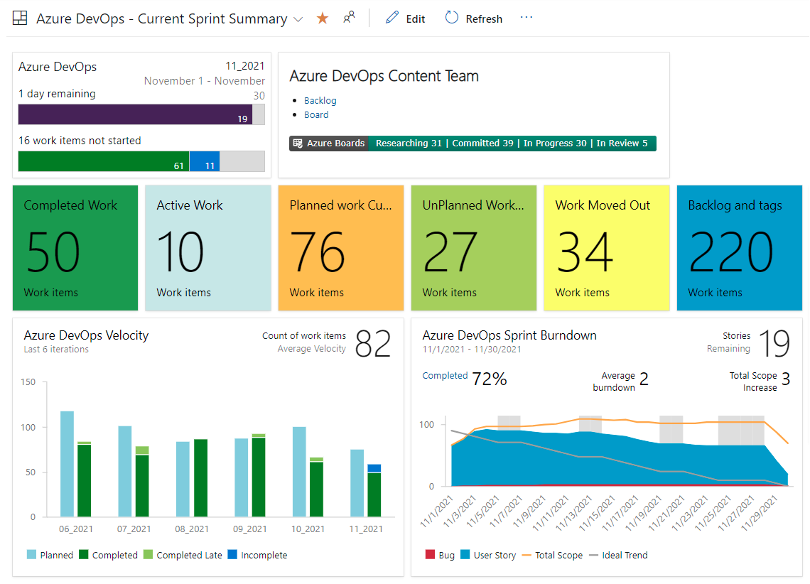

</center>

</div>

---

### Azure Devops

#### Les 5 composants principaux d'Azure DevOps 


<div style="font-size:35px">

2. ### **Azure Repos**

   Gestion de code source (Git ou TFVC) :

   * Contrôle de version.
   * Gestion de branches.
   * Pull Requests.
   * Politiques d'intégration et de revue de code.

</div>

---

### Azure Devops

#### Les 5 composants principaux d'Azure DevOps 


<div style="font-size:35px">

2. ### **Azure Repos**

<center>
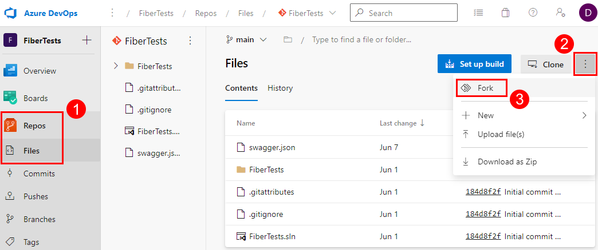

</center>
</div>

---

### Azure Devops

#### Les 5 composants principaux d'Azure DevOps 


<div style="font-size:32px">

3. ### **Azure Pipelines**

   CI/CD automatisés :

   * **Build** automatique et tests intégrés.
   * Déploiement continu sur diverses plateformes (Cloud, VM, conteneurs…).
   * Prise en charge de nombreux langages et plateformes (.NET, Java, Node.js, Angular…).

</div>

---

### Azure Devops

#### Les 5 composants principaux d'Azure DevOps 


<div style="font-size:32px">

3. ### **Azure Pipelines**

<center>
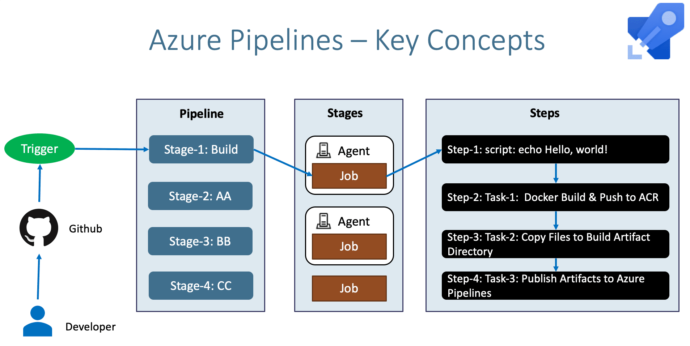

</center>
</div>

---

### Azure Devops

#### Les 5 composants principaux d'Azure DevOps 


<div style="font-size:32px">

3. ### **Azure Pipelines**

<center>
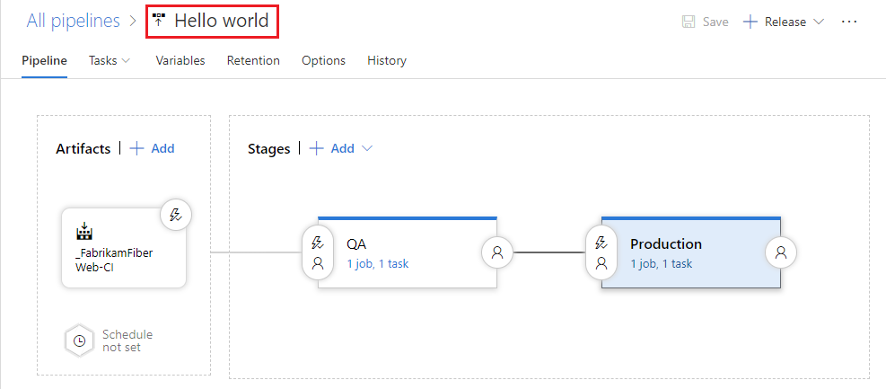

</center>
</div>

---

### Azure Devops

#### Les 5 composants principaux d'Azure DevOps 


<div style="font-size:32px">

4. ### **Azure Test Plans**

   Gestion des tests manuels et automatisés :

   * Tests fonctionnels, tests exploratoires, et plans de tests.
   * Scénarios et campagnes de tests.
   * Analyse et suivi des anomalies.

</div>

---

### Azure Devops

#### Les 5 composants principaux d'Azure DevOps 


<div style="font-size:32px">

4. ### **Azure Test Plans**

<center>
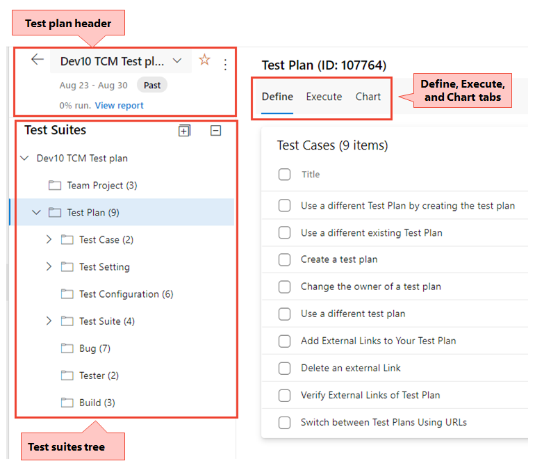

</center>
</div>

---

### Azure Devops

#### Les 5 composants principaux d'Azure DevOps 


<div style="font-size:32px">

5. ### **Azure Artifacts**

   Stockage et gestion des packages :

   * Gestion centralisée de dépendances (npm, NuGet, Maven, PyPI).
   * Distribution des packages internes.
  
</div>

---

### Azure Devops

#### Les 5 composants principaux d'Azure DevOps 


<div style="font-size:32px">

5. ### **Azure Artifacts**

<center>


</center>
</div>

---

### Azure Devops

#### Types de projets dans Azure DevOps 


<div style="font-size:32px">

Azure DevOps propose différents modèles pour s'adapter aux méthodes agiles ou classiques :

* **Agile** : centré sur la gestion des User Stories.
* **Scrum** : orienté vers des cycles courts et itératifs, structuré autour des Sprints.
* **CMMI** (Capability Maturity Model Integration) : approche classique structurée, axée sur les processus, idéale pour les projets réglementés.
* **Basic** : minimaliste, simple à prendre en main, idéal pour les petites équipes.

</div>


---

### Azure Devops

#### Intégrations et extensibilité 


<div style="font-size:32px">

<br>

Azure DevOps permet l'intégration avec de nombreux outils externes comme :

* GitHub, Jenkins, Docker, Kubernetes
* Jira, Slack, Teams, Power BI, Excel
* SonarQube, Selenium, AppDynamics, etc.

Il supporte aussi une **Marketplace** pour ajouter des extensions supplémentaires.

</div>

---

### Azure Devops

#### Dashboards et outils de suivi 


<div style="font-size:32px">


Azure DevOps inclut des outils puissants pour le suivi et l'analyse du projet, accessibles via des tableaux de bord interactifs :

* **Burndown Chart** : suivi quotidien de l'avancement des tâches.
* **Velocity Chart** : suivi des performances et de la capacité de l'équipe.
* **Cumulative Flow Diagram** : visualisation globale de l’état d'avancement du projet.
* **Analytics views** : rapport précis sur les tendances et performances.
* **Widgets personnalisables** : pour afficher backlog, tâches, statuts des builds, tests, etc.

</div>

---

### Azure Devops

#### Exemple concret d'utilisation :


<div style="font-size:27px">

<br>

Une équipe Scrum utilise Azure DevOps :

* **Azure Boards** pour gérer les User Stories et tâches du Sprint.
* **Azure Repos** pour contrôler le code source (branches par feature, pull requests).
* **Azure Pipelines** pour construire automatiquement et déployer leur application sur Azure.
* **Azure Test Plans** pour exécuter leurs tests automatisés et manuels.
* **Azure Artifacts** pour gérer et distribuer les dépendances de l'application.

Le Scrum Master et le PO peuvent suivre facilement la progression grâce aux dashboards interactifs.
</div>

---


<!-- _class: lead -->
<!-- _paginate: false -->

# Azure DevOps – Overview


---

### Azure DevOps – Overview

##### Definition


<div style="font-size:30px">

<br>

La section "**Overview**" d'Azure DevOps représente la page d’accueil d'un projet. Elle permet d'obtenir rapidement une vue synthétique du projet et de naviguer facilement vers les éléments essentiels.

Cette section est divisée en trois onglets principaux :

* ✅ **Summary**
* 📊 **Dashboards**
* 📖 **Wiki**

</div>

---

### Azure DevOps – Overview

##### Overview / Summary

<div style="font-size:28px">

### **1. Summary**

La page "**Summary**" donne une vue globale et synthétique du projet. C’est le point d’entrée idéal pour :

* Comprendre immédiatement le statut du projet.
* Accéder rapidement aux derniers événements (commits, builds, déploiements, pull requests...).
* Visualiser les membres actifs du projet.

</div>

---

### Azure DevOps – Overview

##### Overview / Summary

<div style="font-size:28px">

#### **Éléments clés du Summary :**

| Élément                   | Description                                                            | Exemple d'utilisation réelle                                           |
| ------------------------- | ---------------------------------------------------------------------- | ---------------------------------------------------------------------- |
| **Description du projet** | Courte description du projet, ses objectifs et technologies utilisées. | "EduTrack : Plateforme SaaS pour suivre la progression des apprenants" |
| **Statistiques Rapides**  | Nombre de Work items ouverts, Pull Requests actives, Builds récentes.  | "5 PR ouvertes, 2 builds échoués"                                      |
| **Activité récente**      | Historique des dernières activités.                                    | "Alice a fusionné la branche `feature/login`"                          |
| **Membres du projet**     | Liste des membres avec rôles visibles.                                 | "Mohamed (Scrum Master), Sophie (PO), Thomas (Développeur)"            |

</div>


---

### Azure DevOps – Overview

##### Overview / Summary

<div style="font-size:28px">

<center>
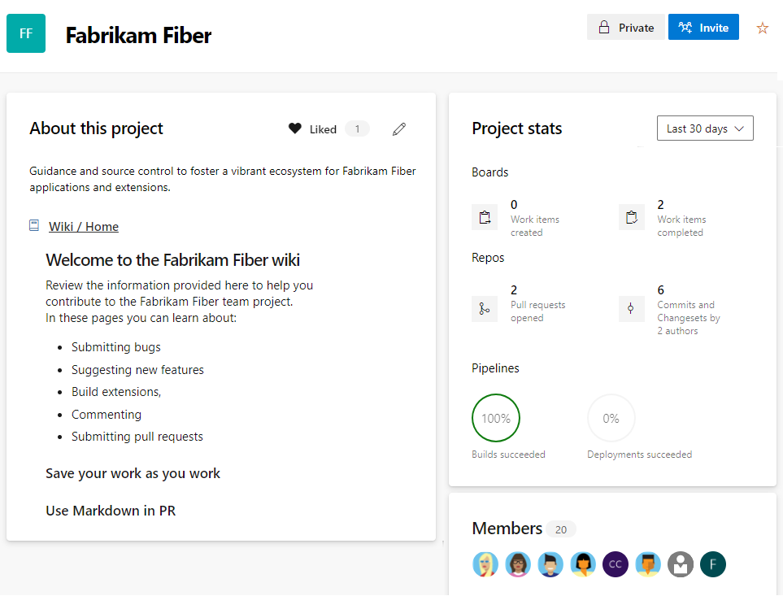

</center>
</div>


---

### Azure DevOps – Overview

#### Overview / Summary

<div style="font-size:35px">

#####  **2. Dashboards**

<br>

Les "**Dashboards**" sont des tableaux de bord entièrement personnalisables permettant de visualiser en temps réel des informations clés sur l'état et l'évolution du projet.

</div>


---

### Azure DevOps – Overview

##### Overview / Summary

<div style="font-size:25px">

#### **Widgets essentiels dans Dashboards :**

| Widget                   | Utilité principale                                                 | Exemple concret                                                          |
| ------------------------ | ------------------------------------------------------------------ | ------------------------------------------------------------------------ |
| **Burndown Chart**       | Suivre l'avancement du sprint et visualiser le travail restant.    | Visualiser précisément si l'équipe est dans les temps.                   |
| **Velocity Chart**       | Évaluer la performance et la capacité de l’équipe par sprint.      | Identifier rapidement les variations de productivité.                    |
| **Cumulative Flow**      | Identifier les goulets d’étranglement et l'état global des tâches. | Observer facilement les retards éventuels dans la validation des tâches. |
| **Assigned Work**        | Liste rapide des tâches affectées à chaque membre.                 | "Thomas : 5 tâches en cours"                                             |
| **Build/Release status** | Visualiser rapidement le statut des builds et déploiements.        | "Dernière build réussie, déploiement PROD OK"                            |
| **Work Items Summary**   | Résumé visuel (Epics, Features, User Stories, Bugs...).            | "12 bugs ouverts dont 3 critiques"                                       |

</div>

---


### Azure DevOps – Overview

#### Overview / Summary

<div style="font-size:30px">

#### **Widgets essentiels dans Dashboards :**

| Widget                   | Utilité principale                                                 | Exemple concret                                                          |
| ------------------------ | ------------------------------------------------------------------ | ------------------------------------------------------------------------ |
| **Build/Release status** | Visualiser rapidement le statut des builds et déploiements.        | "Dernière build réussie, déploiement PROD OK"                            |
| **Work Items Summary**   | Résumé visuel (Epics, Features, User Stories, Bugs...).            | "12 bugs ouverts dont 3 critiques"                                       |

</div>

---

### Azure DevOps – Overview

#### Overview / Summary

<div style="font-size:30px">

#### **Widgets essentiels dans Dashboards :**

<center>
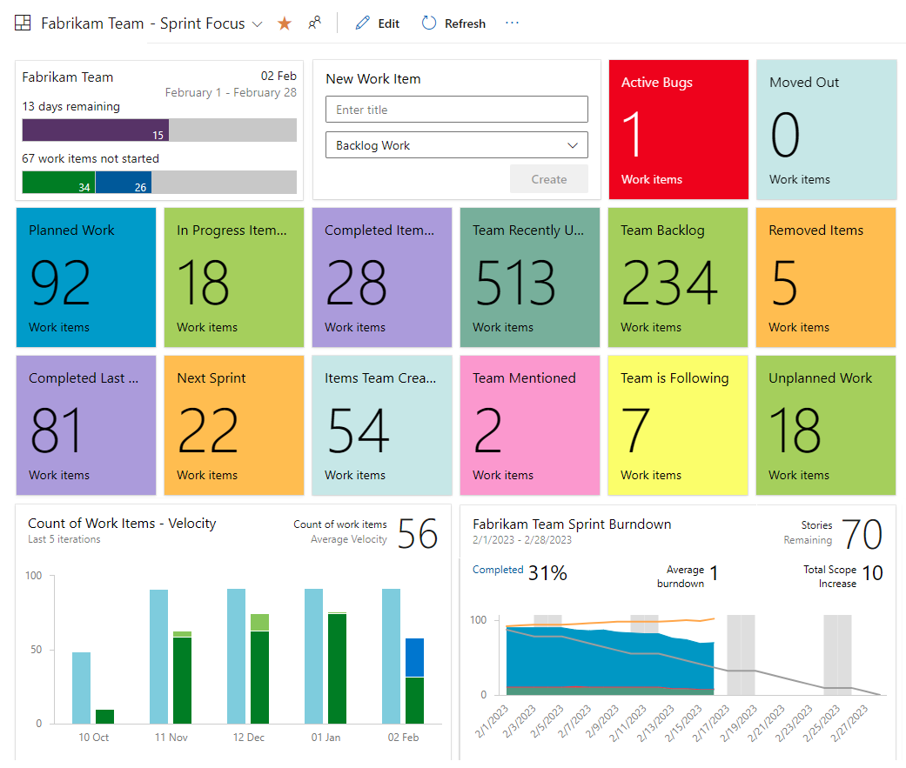

</center>
</div>

---

### Azure DevOps – Overview

#### Overview / Summary

<div style="font-size:22px">

####  **Créer un Dashboard : étapes simples**

* Accéder à "**Overview → Dashboards → New Dashboard**".
* Donner un nom au Dashboard, choisir sa visibilité (**privé ou public**).
* Ajouter des widgets via le bouton "**+ Edit**".
* Positionner et personnaliser chaque widget selon les besoins.
* Sauvegarder le Dashboard.

**Exemple concret :**

Un Dashboard nommé "**Suivi Sprint**" pourrait inclure :

* Un **Burndown Chart**.
* Une vue sur les **bugs critiques**.
* Les statuts des dernières **builds/releases**.
* Liste rapide des **tâches assignées** à chaque membre.                                     

</div>

---

### Azure DevOps – Overview

#### Overview / Summary

<div style="font-size:30px">

#### **3. Wiki**

<br>

Le "**Wiki**" est un espace collaboratif destiné à documenter, partager et structurer des informations liées au projet. Il est utile pour :

* Centraliser la documentation du projet.
* Stocker les informations techniques, fonctionnelles et les procédures.
* Favoriser le partage des connaissances et la collaboration.


</div>

---

### Azure DevOps – Overview

#### Overview / Summary

<div style="font-size:30px">

#### **3. Wiki**

<center>
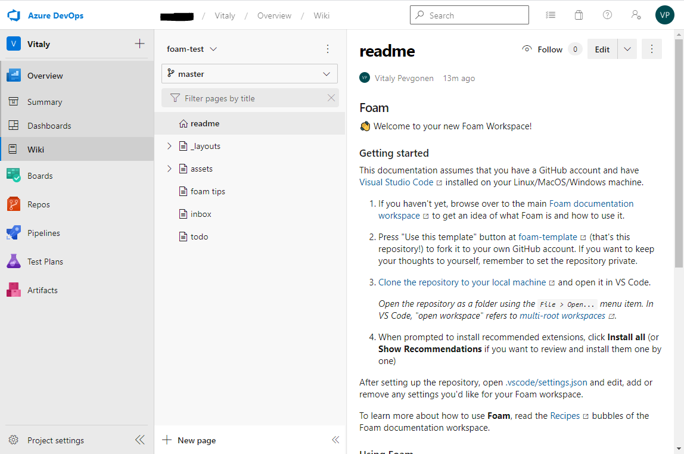

</center>

</div>

---

### Azure DevOps – Overview

#### Overview / Summary

<div style="font-size:30px">

#### **3. Wiki**

<center>
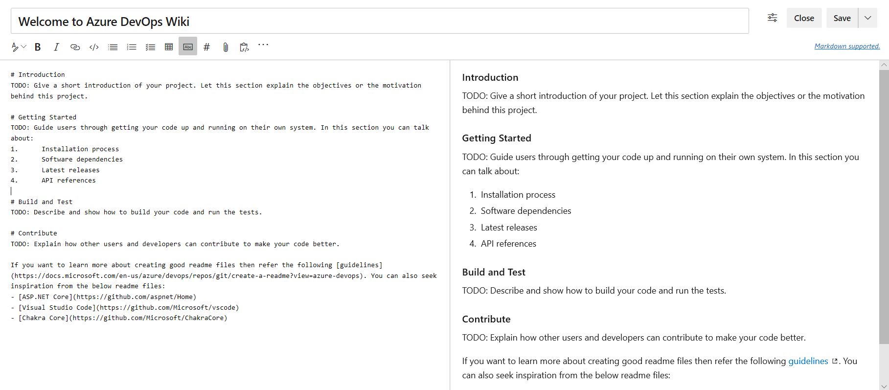

</center>

</div>

---

### Azure DevOps – Overview

#### Overview / Summary

<div style="font-size:23px">

#### **Bonnes pratiques d'organisation du Wiki :**

```markdown
📖 Home
├── 🚩 Introduction générale
├── 🔧 Guide de démarrage rapide (Quickstart)
├── 🎯 Objectifs & Roadmap
├── 🖥️ Architecture technique
│   ├── Frontend (Angular)
│   ├── Backend (Spring Boot, Node.js...)
│   └── Infrastructure (Azure, Terraform...)
├── ⚙️ Guides techniques
│   ├── Environnement de développement
│   ├── Procédure de build et déploiement
│   └── Tests et Qualité
├── 🗂️ Procédures métier
│   ├── Fonctionnalités utilisateurs
│   └── Règles métier
└── 🚨 FAQ & Problèmes connus
```


</div>

---

### Azure DevOps – Overview

#### Overview / Summary

<div style="font-size:20px">


**Exemple d’une page Wiki :**

````markdown
# 🚀 EduTrack – Guide de démarrage rapide

Bienvenue dans EduTrack, la plateforme SaaS pour la gestion de formations.

## 📌 Prérequis :
- Node.js v18+
- Java 17 (Spring Boot)
- Compte Azure avec accès DevOps

## 🛠️ Installation locale :
Clonez le repo, puis lancez :

```bash

git clone https://dev.azure.com/org/edutrack.git
cd edutrack/frontend
npm install && npm start

```

````


</div>

---

### Azure DevOps – Overview

#### Bonnes pratiques des Dashboards

<div style="font-size:30px">

<br>

##### 1. **Adaptez le dashboard à l’audience**

* **Équipe de développement** : burndown chart, bugs, user stories en cours, builds.
* **Management** : KPIs globaux, indicateurs de vélocité, releases, tendances.
* **QA** : couverture de tests, bugs ouverts, résultats de tests automatisés.


</div>

---

### Azure DevOps – Overview

#### Bonnes pratiques des Dashboards

<div style="font-size:30px">

<br>

##### 2.  **Créez un dashboard par objectif ou équipe**

* Un **dashboard par sprint** ou par **équipe agile**.
* Des **dashboards spécifiques aux livraisons** (build, release, incidents).
* Limiter les dashboards trop génériques et non-actionnables.


</div>

---

### Azure DevOps – Overview

#### Bonnes pratiques des Dashboards

<div style="font-size:30px">

<br>

##### 3. **Hiérarchisez les widgets**

* Les **indicateurs critiques en haut** : alertes, tickets bloquants, deadline proche.
* Les données secondaires ou d’analyse en bas.
* Favorisez une **lecture en Z ou F** (regard humain).


</div>

---

### Azure DevOps – Overview

#### Bonnes pratiques sur les widget

<div style="font-size:30px">

<br>

##### 4. **Utilisez les bons widgets**

* **Sprint burndown** : suivi des tâches dans le temps.
* **Work items query results** : affichage de bugs critiques, tâches bloquées.
* **Chart for work items** : graphiques par état, par assigné, par priorité.
* **Build history / Release pipelines** : statuts récents des pipelines.
* **Test results / Code coverage** : vision sur la qualité.


</div>

---

### Azure DevOps – Overview

#### Bonnes pratiques sur les widget

<div style="font-size:35px">

<br>

##### 5.  **Personnalisez les requêtes**

* Créez des **requêtes Work Items** adaptées (par étiquette, assigné, priorité).
* Utilisez des **filtres dynamiques** (par sprint actif, par équipe).


</div>

---

### Azure DevOps – Overview

#### Bonnes pratiques sur les widget

<div style="font-size:35px">

<br>

##### 6. **Mettez à jour régulièrement**

* Supprimez les widgets obsolètes.
* Mettez à jour les requêtes si les sprints changent.
* Synchronisez avec les itérations de l’équipe.


</div>

---

### Azure DevOps – Overview

#### Pratiques de collaboration et gouvernance

<div style="font-size:35px">

<br>

##### 7. **Partagez les dashboards**

* Rendez-les **accessibles à toute l’équipe**.
* Utilisez la **fonction "Clone dashboard"** pour créer des variantes sans tout refaire.
* Attribuez les bons droits : certains membres peuvent modifier, d’autres consulter.
  
</div>

---

### Azure DevOps – Overview

#### Pratiques de collaboration et gouvernance

<div style="font-size:35px">

<br>

#### 8.  **Gardez-les clairs et lisibles**

* Évitez les dashboards trop chargés.
* N'utilisez pas plus de **8–10 widgets visibles sans scroll**.
* **Utilisez des couleurs cohérentes** pour signaler les statuts (rouge pour erreur, vert pour OK). 

</div>

---

### Azure DevOps – Overview

#### Pratiques de collaboration et gouvernance

<div style="font-size:35px">

<br>

##### 9. **Alignez les dashboards avec vos rituels Agile**

* Affichez-le en stand-up ou revues de sprint.
* Faites-en un **support de synchronisation d’équipe**.

</div>

---

### Azure DevOps – Overview

#### Wiki Azure DevOps

<div style="font-size:33px">


##### **Qu’est-ce que le Wiki Azure DevOps ?**

* Un **espace de documentation** basé sur **Markdown**.
* Intégré nativement dans chaque projet Azure DevOps.
* Peut être :

  * **Wiki provisionné** (géré dans Azure DevOps, stocké dans Azure Repos).
  * **Code Wiki** (stocké dans un repo Git de votre projet).
</div>

---

### Azure DevOps – Overview

#### Wiki Azure DevOps

<div style="font-size:25px">

#### **Fonctionnalités principales**

| Fonctionnalité         | Description                                                           |
| ---------------------- | --------------------------------------------------------------------- |
| 📄 Pages hiérarchiques | Structure en arborescence avec pages et sous-pages.                   |
| ✏️ Éditeur Markdown    | Prise en charge de Markdown avec aperçu en direct.                    |
| 🖼️ Ajout d’images     | Glisser-déposer ou via un repo Git.                                   |
| 🔗 Liens internes      | Liens vers d'autres pages ou work items.                              |
| 📅 Historique          | Historique des versions de chaque page (si Code Wiki).                |
| 🔍 Recherche intégrée  | Recherche plein texte dans les pages Wiki.                            |
| 🔒 Gestion des accès   | Permissions granulaires (lecture, édition) par groupe ou utilisateur. |

</div>

---

### Azure DevOps – Overview

#### Wiki Azure DevOps

<div style="font-size:30px">

#### **Bonnes pratiques pour un Wiki efficace**

##### 1.  **Organisez par thème**

Utilisez une arborescence logique :

```
- Projet X
  - Introduction
  - Architecture
  - Déploiement
  - Processus Agile
  - Tests et Qualité
```

</div>

---

### Azure DevOps – Overview

#### Wiki Azure DevOps

<div style="font-size:30px">

#### **Bonnes pratiques pour un Wiki efficace**

##### 2. **Structurez vos pages**

Utilisez :

* Titres `#`, `##`, `###`
* Listes à puces `*`
* Tables
* Blocs de code (\`\`\`bash)
  
</div>

---

### Azure DevOps – Overview

#### Wiki Azure DevOps

<div style="font-size:30px">

#### **Bonnes pratiques pour un Wiki efficace**

##### 3. **Maintenez le Wiki à jour**

* Désignez des **référents de contenu**.
* Ajoutez une **page “Changelog”** ou utilisez le **log Git** si vous utilisez un Code Wiki.
* Archivez les anciennes pages plutôt que de les supprimer.

</div>

---

### Azure DevOps – Overview

#### Wiki Azure DevOps

<div style="font-size:30px">

#### **Bonnes pratiques pour un Wiki efficace**

##### 4.  **Faites des liens utiles**

* Lien vers des **user stories**, des bugs, des pipelines :

  * Exemple : `#123` lie automatiquement au work item 123.
* Lien vers des artefacts externes (SharePoint, Confluence, etc.).

</div>

---

### Azure DevOps – Overview

#### Wiki Azure DevOps

<div style="font-size:30px">

#### **Bonnes pratiques pour un Wiki efficace**

##### 5. **Utilisez-le comme support de formation/onboarding**

* Créez une section "Nouveaux arrivants".
* Documentez :

  * Les outils utilisés.
  * Le processus de livraison.
  * Les contacts clés.

</div>

---

### Azure DevOps – Overview

#### Wiki Azure DevOps

<div style="font-size:35px">

#### **Bonnes pratiques pour un Wiki efficace**

##### 6. **Gérez les accès**

* Limitez l’édition à certains utilisateurs si besoin.
* Ouvrez la lecture à toute l’équipe pour favoriser l’usage.

</div>

---


<!-- _class: lead -->
<!-- _paginate: false -->

# Azure Boards - Vue dʼensemble


---

### Azure Boards - Vue dʼensemble

#### Concepts clés 

<div style="font-size:35px">

<br>

##### 1. Work Items

**Définition :**
Les **Work Items** (éléments de travail) représentent toutes les activités à réaliser dans un projet Agile (ex : Épics, Features, User Stories, Tâches, Bugs, etc.).


</div>

---

### Azure Boards - Vue dʼensemble

#### Concepts clés 

<div style="font-size:30px">


| Type           | Description                                 | Exemple concret                                                                                |
| -------------- | ------------------------------------------- | ---------------------------------------------------------------------------------------------- |
| **Epic**       | Objectif large à atteindre (grande échelle) | « Développer un portail de gestion des formations »                                            |
| **Feature**    | Fonctionnalité précise à livrer             | « Gestion des inscriptions en ligne »                                                          |
| **User Story** | Besoin utilisateur spécifique               | « En tant qu’apprenant, je veux télécharger mon certificat pour le présenter à mon employeur » |
| **Task**       | Activité technique précise                  | « Développer le backend d’export PDF des certificats »                                         |
| **Bug**        | Problème ou dysfonctionnement à résoudre    | « La génération du PDF échoue lorsqu'un nom contient un caractère spécial »                    |

</div>

---

### Azure Boards - Vue dʼensemble

#### Concepts clés 

<div style="font-size:30px">

<br>

#### 2. Backlogs

**Définition :**
Les **Backlogs** sont des listes hiérarchisées des Work Items permettant une gestion claire des priorités.

#### Types de Backlogs :

* **Epic Backlog** (vision stratégique)
* **Feature Backlog** (planification à moyen terme)
* **User Story Backlog** (planification opérationnelle)


</div>

---

### Azure Boards - Vue dʼensemble

#### Concepts clés 

<div style="font-size:30px">

#### 2. Backlogs


```plaintext
Epic : Portail Apprenant
│
└── Feature : Authentification sécurisée
    ├── User Story : Se connecter avec MFA
    ├── User Story : Réinitialiser mot de passe
    └── User Story : Se connecter avec SSO

Epic : Monitoring DevOps
│
└── Feature : Suivi des performances
    ├── User Story : Visualiser les temps de réponse API
    └── User Story : Suivre le taux d’erreurs
```


</div>

---

### Azure Boards - Vue dʼensemble

#### Concepts clés 

<div style="font-size:30px">

##### 3. Boards (Kanban)

**Définition :**
Les **Boards** sont des tableaux Kanban visuels permettant le suivi de l’avancement des tâches d’un coup d’œil.

##### Colonnes typiques :

* À faire (To do)
* En cours (Doing)
* En test (Testing)
* Terminé (Done)

</div>

---

### Azure Boards - Vue dʼensemble

#### Concepts clés 

<div style="font-size:30px">

#### 3. Boards (Kanban)

##### Exemple de suivi concret :

| À faire                  | En cours                            | En test                    | Terminé                     |
| ------------------------ | ----------------------------------- | -------------------------- | --------------------------- |
| Développer la page login | API génération PDF                  | Export PDF des certificats | Correction affichage mobile |
| Notification par email   | Correction du bug caractère spécial |                            | Mise en place du MFA        |

</div>

---

### Azure Boards - Vue dʼensemble

#### Concepts clés 

<div style="font-size:35px">

<br>

#### 4. Sprints


**Définition :**
Les **Sprints** représentent des périodes de temps fixes (typiquement 2-4 semaines) durant lesquelles l’équipe livre un ensemble précis de fonctionnalités.


</div>

---

### Azure Boards - Vue dʼensemble

#### Concepts clés 

<div style="font-size:25px">


#### 4. Sprints

### Exemple de planification d’un Sprint :

* **Sprint 12 : (1er Mai → 15 Mai)**

  * User Story : « Se connecter avec MFA »
  * User Story : « Visualiser les temps de réponse API »
  * Bug : « Correction du bug PDF caractères spéciaux »

### Outils de suivi des Sprints :

* **Burndown Chart** : Suivi visuel de l’avancement du Sprint.
* **Capacity Planning** : Gestion des capacités des membres de l'équipe.

</div>

---

### Azure Boards - Vue dʼensemble

#### Concepts clés 

<div style="font-size:30px">


#### 5. Queries (Requêtes)

**Définition :**
Les **Queries** permettent d’effectuer des recherches et filtrages précis sur les Work Items afin de visualiser rapidement des informations pertinentes.

### Exemples de requêtes utiles :

* **Requête des Bugs critiques ouverts :**

  ```plaintext
  Type = Bug
  AND State <> Closed
  AND Priority = 1
  ```

</div>

---

### Azure Boards - Vue dʼensemble

#### Concepts clés 

<div style="font-size:30px">


#### 5. Queries (Requêtes)

#### Exemples de requêtes utiles :

* **Requête des User Stories assignées à un développeur précis :**

  ```plaintext
  Type = User Story
  AND Assigned To = "Développeur1"
  AND State IN (Active, New)
  ```

* **Requête des Work Items non associés à un Sprint :**

  ```plaintext
  Iteration Path = ""
  AND State NOT IN (Closed, Removed)
  ```

</div>

---

### Azure Boards - Vue dʼensemble

#### Types de projets 

<div style="font-size:30px">

#### Les 4 types de projets Azure Boards

Azure Boards propose 4 templates principaux pour structurer vos projets. Chaque template inclut des Work Items, flux de travail, et terminologies adaptés aux besoins spécifiques des équipes.

1. **Agile**
2. **Scrum**
3. **CMMI**
4. **Basic**

</div>

---

### Azure Boards - Vue dʼensemble

#### Types de projets 

<div style="font-size:23px">

####  1. Projet **Agile**

**Caractéristiques :**

* Approche très flexible, idéale pour les équipes dynamiques.
* Terminologie simple (Epic, Feature, User Story, Task, Bug).
* Flux de travail simple et direct.

#### Work Items principaux :

* **Epic**
* **Feature**
* **User Story**
* **Task**
* **Bug**

</div>

---

### Azure Boards - Vue dʼensemble

#### Types de projets 

<div style="font-size:25px">

####  1. Projet **Agile**

### Flux typique d’une User Story :

```
New → Active → Resolved → Closed
```

### Cas d’utilisation typique :

* Équipes privilégiant une gestion souple des priorités.
* Projets évolutifs où les besoins changent fréquemment.

**Exemple concret :**

> Startup développant une application web grand public avec changements fréquents et adaptations rapides aux retours utilisateurs.
</div>

---

### Azure Boards - Vue dʼensemble

#### Types de projets 

<div style="font-size:25px">

####  1. Projet **Agile**

<center>


</center>
</div>

---

### Azure Boards - Vue dʼensemble

#### Types de projets 

<div style="font-size:20px">

#### 2. Projet **Scrum**

**Caractéristiques :**

* Gestion rigoureuse par itérations (Sprints).
* Respect des rôles Scrum (Product Owner, Scrum Master, équipe de développement).
* Accent mis sur la planification des livrables et la transparence.

#### Work Items principaux :

* **Epic**
* **Feature**
* **Product Backlog Item (PBI)** (équivalent des User Stories)
* **Task**
* **Impediment** (obstacle bloquant l’avancement)
* **Bug**

</div>

---

### Azure Boards - Vue dʼensemble

#### Types de projets 

<div style="font-size:20px">

#### 2. Projet **Scrum**

<center>

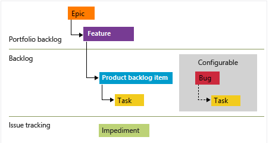

</center>

</div>

---

### Azure Boards - Vue dʼensemble

#### Types de projets 

<div style="font-size:25px">

#### 2. Projet **Scrum**

### Flux typique d’un PBI :

```
New → Approved → Committed → Done
```

### Cas d’utilisation typique :

* Équipes appliquant strictement les méthodologies Scrum.
* Projets nécessitant une planification claire des livraisons à intervalle régulier.

**Exemple concret :**

> Équipe informatique d’une banque mettant en place un nouveau portail client, avec des livraisons régulières toutes les deux semaines.

</div>

---

### Azure Boards - Vue dʼensemble

#### Types de projets 

<div style="font-size:35px">


#### 3. Projet **CMMI**

**Caractéristiques :**

* Processus très structuré, axé sur la conformité, la documentation et l’audit.
* Gestion fine des risques, exigences, et changements.
* Typiquement utilisé dans les secteurs fortement régulés.


</div>

---

### Azure Boards - Vue dʼensemble

#### Types de projets 

<div style="font-size:25px">

#### 3. Projet **CMMI**

##### Work Items principaux :

* **Epic**
* **Feature**
* **Requirement** (Exigence fonctionnelle détaillée)
* **Task**
* **Bug**
* **Change Request** (Demande de modification)
* **Risk** (Gestion des risques)
* **Review** (Revue formelle)


</div>

---

### Azure Boards - Vue dʼensemble

#### Types de projets 

<div style="font-size:25px">

#### 3. Projet **CMMI**

<center>

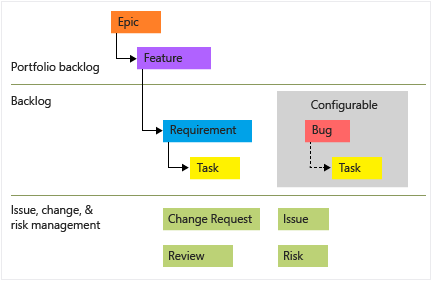

</center>
</div>

---

### Azure Boards - Vue dʼensemble

#### Types de projets 

<div style="font-size:25px">

#### Flux typique d’une exigence (Requirement) :

```
Proposed → Active → Resolved → Closed
```

#### Cas d’utilisation typique :

* Secteurs régulés nécessitant une documentation rigoureuse (banque, assurance, aéronautique, santé).
* Projets soumis à audit.

**Exemple concret :**

> Développement logiciel pour un équipement médical nécessitant une conformité stricte aux réglementations.

</div>

---

### Azure Boards - Vue dʼensemble

#### Types de projets 

<div style="font-size:25px">

#### 4. Projet **Basic**

**Caractéristiques :**

* Approche simplifiée, très accessible.
* Adapté aux petits projets ou aux équipes débutantes dans Azure DevOps.
* Terminologie minimaliste (Issue, Task, Epic).

### Work Items principaux :

* **Epic** (Objectif global large)
* **Issue** (problème ou besoin métier à résoudre, simple et générique)
* **Task**

</div>

---

### Azure Boards - Vue dʼensemble

#### Types de projets 

<div style="font-size:25px">

#### 4. Projet **Basic**

#### Flux typique d’une Issue :

```
To Do → Doing → Done
```

#### Cas d’utilisation typique :

* Petites équipes, projets simples.
* Équipes débutant avec Azure DevOps ou cherchant simplicité et rapidité.

**Exemple concret :**

> Petite équipe marketing gérant des campagnes événementielles, tâches simples et directes.

</div>

---

### Azure Boards - Vue dʼensemble

#### Types de projets 

<div style="font-size:25px">

#### 4. Projet **Basic**

<center>


</center>
</div>

---

#### Azure Boards - Vue dʼensemble

##### Types de projets 

<div style="font-size:25px">

| Caractéristiques           | Agile                              | Scrum                                    | CMMI             | Basic                     |
| -------------------------- | ---------------------------------- | ---------------------------------------- | ---------------- | ------------------------- |
| **Souplesse**              | ✅ Très élevée                      | ✅ Moyenne                                | ❌ Faible         | ✅ Élevée                  |
| **Documentation exigée**   | ⚠️ Moyenne                         | ⚠️ Moyenne                               | ✅ Élevée         | ❌ Faible                  |
| **Terminologie utilisée**  | Simple                             | Scrum officielle                         | Formelle         | Minimaliste               |
| **Gestion des itérations** | ✅ Flexible                         | ✅ Rigoureuse (Sprints)                   | ✅ Structurée     | ❌ Simple                  |
| **Secteurs typiques**      | Équipes agiles (startups, digital) | Équipes Agile Scrum (moyen/grand projet) | Secteurs régulés | Petits projets, débutants |

</div>

---

### Azure Boards - Vue dʼensemble

#### Types de projets 

<div style="font-size:25px">

#### Comment choisir le bon template ?

**Questions à se poser :**

* Quelle est la taille et la maturité de l'équipe ?
* Le projet est-il soumis à des contraintes réglementaires fortes ?
* Souhaitez-vous adopter une méthodologie Agile rigoureuse (Scrum), souple (Agile), très formelle (CMMI), ou simplifiée (Basic) ?

**Recommandations :**

* Débutants, projets courts → **Basic**
* Méthodologie Agile souple, adaptabilité élevée → **Agile**
* Projets structurés avec Sprints précis → **Scrum**
* Réglementation forte, documentation importante → **CMMI**
  
</div>

---

### Azure Boards - Vue dʼensemble

#### Cycle de vie typique des différents Work Items

<div style="font-size:35px">

<br>

##### **1. User Story (Agile) / Product Backlog Item - PBI (Scrum)**

Les User Stories ou PBIs représentent les besoins spécifiques des utilisateurs.

**Cycle de vie typique :**

```
New → Active → Resolved → Closed
```

</div>

---

### Azure Boards - Vue dʼensemble

#### Cycle de vie typique des différents Work Items

<div style="font-size:29px">

#### **1. User Story (Agile) / Product Backlog Item - PBI (Scrum)**


| État         | Description précise                                      | Exemple concret                                                         |
| ------------ | -------------------------------------------------------- | ----------------------------------------------------------------------- |
| **New**      | Créée, en attente d'affectation ou de démarrage.         | « En tant qu’utilisateur, je souhaite réinitialiser mon mot de passe. » |
| **Active**   | Actuellement en cours de réalisation par l’équipe.       | Développeur implémente la réinitialisation du mot de passe.             |
| **Resolved** | Implémentée, mais en attente de validation ou de test.   | Fonctionnalité développée et poussée en environnement de test.          |
| **Closed**   | Testée, validée, acceptée par le PO ou les utilisateurs. | Fonctionnalité validée et déployée en production.                       |

</div>

---


### Azure Boards - Vue dʼensemble

#### Cycle de vie typique des différents Work Items

<div style="font-size:35px">

<br>

#####  **2. Bug**

Les Bugs représentent des problèmes ou anomalies identifiées dans l’application.

**Cycle de vie typique :**

```
New → Active → Resolved → Closed
```


</div>

---


### Azure Boards - Vue dʼensemble

#### Cycle de vie typique des différents Work Items

<div style="font-size:35px">

#####  **2. Bug**


| État         | Description précise                               | Exemple concret                                            |
| ------------ | ------------------------------------------------- | ---------------------------------------------------------- |
| **New**      | Bug identifié, enregistré dans le backlog.        | « Erreur de génération PDF sur les noms spéciaux »         |
| **Active**   | Bug en cours de correction par un développeur.    | Développeur corrige le problème de caractères spéciaux.    |
| **Resolved** | Bug corrigé, en attente de tests de vérification. | Correction en environnement de test prête pour validation. |
| **Closed**   | Correction testée, validée, et confirmée résolue. | Le bug n’apparaît plus après les tests.                    |


</div>

---


### Azure Boards - Vue dʼensemble

#### Cycle de vie typique des différents Work Items

<div style="font-size:29px">

<br>

#### **3. Task (Tâche)**

Les tâches représentent des travaux techniques spécifiques nécessaires à la réalisation des User Stories ou PBIs.

**Cycle de vie typique :**

```
To Do → In Progress → Done
```

</div>

---

### Azure Boards - Vue dʼensemble

#### Cycle de vie typique des différents Work Items

<div style="font-size:29px">

<br>

#### **3. Task (Tâche)**


| État            | Description précise                              | Exemple concret                                |
| --------------- | ------------------------------------------------ | ---------------------------------------------- |
| **To Do**       | Planifiée, mais pas encore démarrée.             | « Développer API PDF génération »              |
| **In Progress** | Actuellement en cours de réalisation.            | Développeur écrit le code de l’API PDF.        |
| **Done**        | Réalisée, terminée et prête à être revue/testée. | API développée, intégrée, et prête pour tests. |


</div>

---

### Azure Boards - Vue dʼensemble

#### Cycle de vie typique des différents Work Items

<div style="font-size:29px">

<br>

#### **4. Epic**

Les Épics représentent des objectifs larges à atteindre, souvent découpés en Features et User Stories.

**Cycle de vie typique :**

```
New → Active → Resolved → Closed
```


</div>

---

### Azure Boards - Vue dʼensemble

#### Cycle de vie typique des différents Work Items

<div style="font-size:25px">


#### **4. Epic**

| État         | Description précise                                          | Exemple concret                       |
| ------------ | ------------------------------------------------------------ | ------------------------------------- |
| **New**      | Créée, en attente de planification et de décomposition.      | « Portail de gestion des formations » |
| **Active**   | En cours, Features et User Stories associées en réalisation. | Plusieurs fonctionnalités en cours.   |
| **Resolved** | Toutes les Features associées ont été réalisées.             | L'ensemble du portail est implémenté. |
| **Closed**   | Objectif global atteint, validé par les parties prenantes.   | Portail validé, mis en production.    |


</div>

---

### Azure Boards - Vue dʼensemble

#### Cycle de vie typique des différents Work Items

<div style="font-size:29px">


<br>

#### **5. Feature**

Les Features représentent des ensembles de fonctionnalités ou sous-objectifs intermédiaires.

**Cycle de vie typique :**

```
New → Active → Resolved → Closed
```

</div>

---


### Azure Boards - Vue dʼensemble

#### Cycle de vie typique des différents Work Items

<div style="font-size:29px">


#### **5. Feature**


| État         | Description précise                                  | Exemple concret                                          |
| ------------ | ---------------------------------------------------- | -------------------------------------------------------- |
| **New**      | Identifiée et définie clairement.                    | « Inscription en ligne des apprenants »                  |
| **Active**   | Actuellement en cours de développement par l’équipe. | Fonctionnalité développée par les équipes back et front. |
| **Resolved** | Implémentation terminée, en attente de validation.   | Tests finaux réalisés et validés par PO.                 |
| **Closed**   | Validée et déployée en environnement opérationnel.   | Inscriptions actives en production.                      |
</div>

---


### Azure Boards - Vue dʼensemble

#### Cycle de vie typique des différents Work Items

<div style="font-size:35px">


#### **Résumé simplifié des états clés :**

| Work Item      | États principaux                   | Usage principal                   |
| -------------- | ---------------------------------- | --------------------------------- |
| **User Story** | `New → Active → Resolved → Closed` | Besoins utilisateurs précis       |
| **Bug**        | `New → Active → Resolved → Closed` | Correction d’anomalies            |
| **Task**       | `To Do → In Progress → Done`       | Actions techniques                |
| **Epic**       | `New → Active → Resolved → Closed` | Objectif global d’un projet       |
| **Feature**    | `New → Active → Resolved → Closed` | Sous-ensembles de fonctionnalités |


---

### Azure Boards - Vue dʼensemble

##### Bonnes pratiques pour choisir son template de projet Azure Boards

<div style="font-size:30px">

#### Critères clés pour choisir un template

Lors de la sélection d'un modèle Azure Boards, il est essentiel d’évaluer ces critères fondamentaux :

* **Complexité du projet**
* **Taille et maturité de l'équipe**
* **Contraintes réglementaires et documentaires**
* **Niveau de flexibilité souhaitée**
* **Méthodologie Agile déjà utilisée (Scrum, Kanban, etc.)**
</div>

---

### Azure Boards - Vue dʼensemble

##### Bonnes pratiques pour choisir son template de projet Azure Boards

<div style="font-size:30px">

##### Présentation rapide des 4 templates :

| Template  | Niveau de Flexibilité | Réglementation & Documentation | Itérations (Sprints) | Complexité typique du projet |
| --------- | --------------------- | ------------------------------ | -------------------- | ---------------------------- |
| **Agile** | Très élevée ✅         | Moyenne ⚠️                     | Flexible ✅           | Moyenne à forte              |
| **Scrum** | Moyenne ✅             | Moyenne ⚠️                     | Rigoureuse ✅         | Moyenne à forte              |
| **CMMI**  | Faible ❌              | Élevée ✅                       | Très rigoureuse ✅    | Forte                        |
| **Basic** | Élevée ✅              | Faible ❌                       | Simplifiée ❌         | Faible à moyenne             |

</div>

---

### Azure Boards - Vue dʼensemble

##### Bonnes pratiques pour choisir son template de projet Azure Boards

<div style="font-size:25px">

#### Quand choisir chaque template ?

##### 1️⃣ **Template Agile**

Adapté aux équipes dynamiques et aux projets évolutifs.

**Contexte idéal :**

* Équipes agiles avec une gestion souple et réactive.
* Projets web, applications mobiles ou startups.
* Changements fréquents des priorités ou besoins métiers.

**Exemple concret :**

Une start-up développant une application mobile grand public avec des modifications fréquentes en fonction des retours utilisateurs.

</div>

---

### Azure Boards - Vue dʼensemble

##### Bonnes pratiques pour choisir son template de projet Azure Boards

<div style="font-size:27px">

#### 2️⃣ **Template Scrum**

Adapté à une méthodologie Agile rigoureuse avec des rôles et Sprints bien définis.

**Contexte idéal :**

* Équipes utilisant strictement Scrum (Product Owner, Scrum Master, etc.).
* Projets avec cycles de livraisons réguliers (toutes les 2 à 4 semaines).
* Planification claire et précise des tâches.

**Exemple concret :**

Équipe IT d'une entreprise mettant en place un portail client nécessitant une livraison régulière et des revues systématiques.

</div>

---

### Azure Boards - Vue dʼensemble

##### Bonnes pratiques pour choisir son template de projet Azure Boards

<div style="font-size:27px">

#### 3️⃣ **Template CMMI**

Adapté aux projets nécessitant documentation stricte et gestion rigoureuse des risques.

**Contexte idéal :**

* Projets soumis à des audits réguliers (banque, santé, aéronautique).
* Équipes devant documenter toutes les étapes du projet.
* Gestion précise des exigences, risques, changements et revues.

**Exemple concret :**

Développement logiciel pour des équipements médicaux devant respecter des réglementations strictes (FDA, CE, ISO).

</div>

---

### Azure Boards - Vue dʼensemble

##### Bonnes pratiques pour choisir son template de projet Azure Boards

<div style="font-size:27px">

#### 4️⃣ **Template Basic**

Adapté aux petits projets ou équipes novices cherchant simplicité et rapidité.

**Contexte idéal :**

* Petites équipes débutantes avec Azure DevOps.
* Projets simples, clairs et courts.
* Gestion minimale avec moins de terminologie spécifique.

**Exemple concret :**

Équipe marketing ou communication gérant des événements ponctuels ou petites campagnes digitales.

</div>

---

### Azure Boards - Vue dʼensemble

##### Bonnes pratiques pour choisir son template de projet Azure Boards

<div style="font-size:21px">

##### Bonnes pratiques supplémentaires :

* **Commencez simplement :**

  * Si vous êtes novice, débutez par **Basic ou Agile** puis évoluez vers **Scrum ou CMMI** si besoin.

* **Réévaluez régulièrement :**

  * Le choix du template peut évoluer en fonction de l’évolution de la maturité de votre équipe et du projet.

* **Formez vos équipes :**

  * Accompagnez votre équipe à comprendre clairement les rôles et workflows associés au template choisi.

* **Adaptez vos outils à vos méthodes de travail réelles :**

  * Ne forcez pas une méthode complexe si votre équipe est encore débutante.
</div>

---


<!-- _class: lead -->
<!-- _paginate: false -->

# Configuration avancée dʼAzure Boards


---

### Configuration avancée dʼAzure Boards

#### Suivre et analyser lʼavancement avec les Queries

<div style="font-size:30px">

##### **Qu’est-ce qu'une Query (Requête) ?**

Une **Query** permet de créer une vue personnalisée pour rechercher, filtrer, trier et regrouper des Work Items selon différents critères spécifiques.

Les requêtes sont utilisées pour :

* Suivre l’avancement global ou individuel.
* Identifier des tâches bloquées ou en retard.
* Contrôler la répartition du travail.
* Faciliter les réunions de revue (Daily, Sprint review).

</div>

---

### Configuration avancée dʼAzure Boards

#### Suivre et analyser lʼavancement avec les Queries

<div style="font-size:27px">

#### **Comment créer une Query ?**

##### Étapes :

1. Dans Azure DevOps, accédez à **Boards > Queries**.
2. Cliquez sur **New Query**.

###### Types de requêtes :

* **Flat List** : Liste simple des items filtrés.
* **Tree of Work Items** : Vue hiérarchique des items (Epic → Feature → User Story → Tasks).
* **Work items and direct links** : Affiche des relations directes entre Work Items.


</div>

---

### Configuration avancée dʼAzure Boards

#### Suivre et analyser lʼavancement avec les Queries

<div style="font-size:27px">

####  **Exemples utiles et pratiques de Queries**

Voici plusieurs exemples utiles, structurés selon des cas fréquents :

##### **Exemple 1 : Tâches en cours du Sprint actuel**

Cette requête permet à chaque membre de l'équipe d’identifier rapidement les tâches ouvertes.

* **Query :**

```sql
Work Item Type = Task
AND State <> Closed
AND Iteration Path = @CurrentIteration
```

* **Utilité :**
  Identifier rapidement les tâches non terminées du sprint en cours.


</div>

---

### Configuration avancée dʼAzure Boards

#### Suivre et analyser lʼavancement avec les Queries

<div style="font-size:30px">

##### **Exemple 2 : Mon travail actuel**

* **Query :**

```sql
Assigned To = @Me
AND State <> Closed
AND Iteration Path = @CurrentIteration
```

* **Utilité :**
  Vue personnalisée de vos tâches actives pendant le sprint en cours.

</div>

---

### Configuration avancée dʼAzure Boards

#### Suivre et analyser lʼavancement avec les Queries

<div style="font-size:30px">

#####  **Exemple 3 : Tâches en retard**

* **Query :**

```sql
Work Item Type = Task
AND State <> Closed
AND Iteration End Date < @Today
```

* **Utilité :**
  Identifier rapidement les tâches qui auraient dû être terminées mais ne le sont pas.

</div>

---

### Configuration avancée dʼAzure Boards

#### Suivre et analyser lʼavancement avec les Queries

<div style="font-size:30px">

##### **Exemple 4 : User Stories bloquées**

* **Query :**

```sql
Work Item Type = User Story
AND Tags CONTAINS "Bloqué"
```

* **Utilité :**
  Identifier immédiatement les User Stories nécessitant une intervention rapide.

</div>

---

### Configuration avancée dʼAzure Boards

#### Suivre et analyser lʼavancement avec les Queries

<div style="font-size:30px">

#### **Utilisation avancée des Queries**

Azure DevOps permet d’utiliser des fonctions et variables avancées pour plus de précision et automatisation :

| Fonction            | Description                                 |
| ------------------- | ------------------------------------------- |
| `@Me`               | Utilisateur connecté                        |
| `@CurrentIteration` | Sprint en cours                             |
| `@Today`            | Date du jour                                |
| `Under`             | Tous les items sous une certaine hiérarchie |
| `Was Ever`          | Historique d’un état                        |

</div>

---

### Configuration avancée dʼAzure Boards

#### Suivre et analyser lʼavancement avec les Queries


<br>
<div style="font-size:20px">
Travail actif non attribué au sprint actuel
</div>
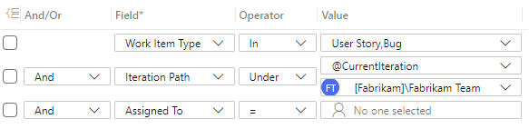

<br>
<div style="font-size:18px">
Travail actif attribué à un sprint passé
</div>
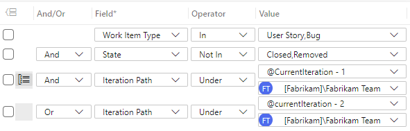


---

### Configuration avancée dʼAzure Boards

#### Suivre et analyser lʼavancement avec les Queries

<div style="font-size:30px">

##### **Bonnes pratiques pour les Queries**

* Créer des Queries communes accessibles à toute l’équipe pour standardiser le suivi.
* Automatiser l’exécution régulière des Queries importantes via les alertes et notifications.
* Utiliser des noms explicites et cohérents : ex. « Sprint actuel - Tâches ouvertes ».

</div>

---

### Configuration avancée dʼAzure Boards

#### Suivre et analyser lʼavancement avec les Queries

<div style="font-size:30px">

##### **Exporter et intégrer des Queries au Dashboard**

Les requêtes peuvent facilement être intégrées aux dashboards pour une visibilité immédiate :

* Créez une Query.
* Depuis le Dashboard, ajoutez le widget « Query Results » ou « Chart for Work Items ».
* Sélectionnez la Query existante et configurez le visuel souhaité.

</div>

---

### Configuration avancée dʼAzure Boards

#### Utiliser les Charts et Widgets de suivi avancé

<div style="font-size:32px">

##### **Pourquoi utiliser des Charts et Widgets ?**

Les widgets et les charts offrent une représentation visuelle claire des données issues des Work Items, permettant :

* **Suivi rapide** de l’avancement général et individuel.
* **Détection précoce** des retards ou des anomalies.
* **Aide à la décision** basée sur des données concrètes.
* **Présentation claire** lors des réunions d'équipe ou de management.
</div>

---

### Configuration avancée dʼAzure Boards

#### Utiliser les Charts et Widgets de suivi avancé

<div style="font-size:28px">

##### **Les Widgets Avancés à utiliser absolument**

##### 1️⃣ **Burndown Chart**

* **Utilité :**

  * Visualiser la quantité de travail restante par rapport au temps écoulé dans le Sprint.
  * Identifier rapidement les retards éventuels.

* **Recommandation :**

  * Mettre à jour quotidiennement le champ **Remaining Work**.
</div>

---

### Configuration avancée dʼAzure Boards

#### Utiliser les Charts et Widgets de suivi avancé

<div style="font-size:28px">

##### **Les Widgets Avancés à utiliser absolument**

##### 1️⃣ **Burndown Chart**
<center>

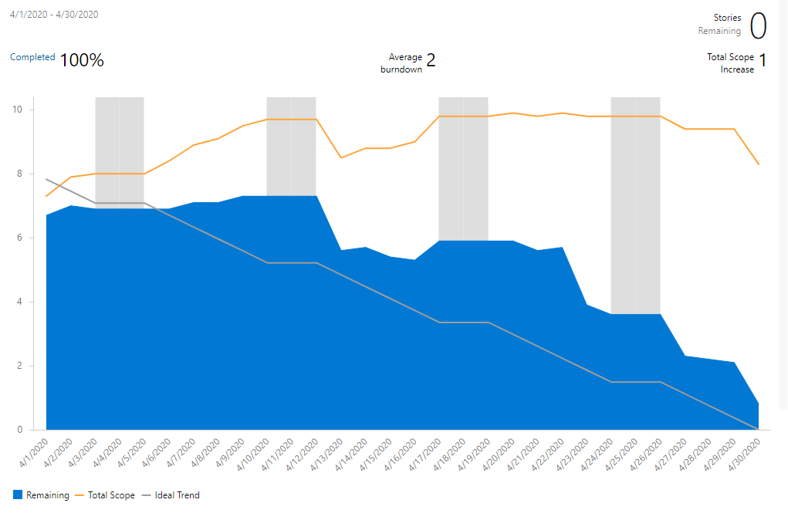

</center>

</div>

---

### Configuration avancée dʼAzure Boards

#### Utiliser les Charts et Widgets de suivi avancé

<div style="font-size:28px">

##### **Les Widgets Avancés à utiliser absolument**

##### 2️⃣ **Velocity Chart**

* **Utilité :**

  * Comparer le travail planifié vs. réalisé dans chaque sprint.
  * Anticiper la capacité future de l'équipe.

* **Bonnes pratiques :**

  * Compléter les Story Points dans chaque User Story.
  * Vérifier régulièrement la répartition des états : Planned, Completed, Completed Late, Incomplete.

  
</div>

---

### Configuration avancée dʼAzure Boards

#### Utiliser les Charts et Widgets de suivi avancé

<div style="font-size:28px">

##### **Les Widgets Avancés à utiliser absolument**

##### 2️⃣ **Velocity Chart**

<center>

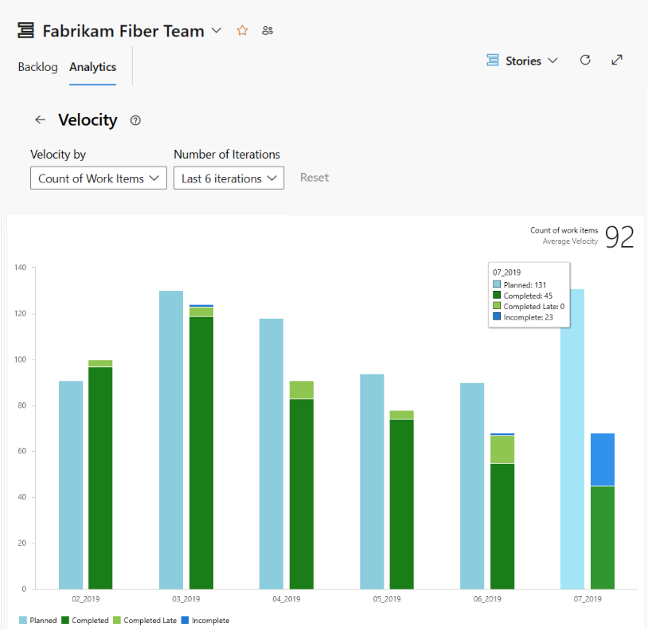

</center>
  
</div>

---

### Configuration avancée dʼAzure Boards

#### Utiliser les Charts et Widgets de suivi avancé

<div style="font-size:28px">

##### **Les Widgets Avancés à utiliser absolument**

##### 3️⃣ **Cumulative Flow Diagram (CFD)**

* **Utilité :**

  * Identifier les goulets d'étranglement (zones où le travail stagne).
  * Analyser le flux de travail à travers les différents états.

* **Utilisation avancée :**

  * Ajouter des colonnes personnalisées sur vos Boards (ex. Validation Métier, En attente, etc.).

  
</div>

---

### Configuration avancée dʼAzure Boards

#### Utiliser les Charts et Widgets de suivi avancé

<div style="font-size:28px">

##### 4️⃣ **Sprint Capacity Widget**

* **Utilité :**

  * Vérifier en temps réel la répartition du travail en heures dans votre équipe.
  * Détecter les surcharges ou sous-charges individuelles.

* **Utilisation avancée :**

  * Définir clairement la capacité en heures de chaque membre de l'équipe au début du sprint.

</div>

---

### Configuration avancée dʼAzure Boards

#### Utiliser les Charts et Widgets de suivi avancé

<div style="font-size:30px">

##### 5️⃣ **Cycle Time Widget**

* **Utilité :**

  * Mesurer le temps moyen de réalisation d'un élément (ex : User Story).
  * Identifier rapidement les éléments problématiques ou complexes.

* **Exemple de configuration :**

  * User Story, état initial : **Active**, état final : **Closed**.

</div>

---

### Configuration avancée dʼAzure Boards

#### Utiliser les Charts et Widgets de suivi avancé

<div style="font-size:30px">

##### 6️⃣ **Chart for Work Items**

* **Utilité :**

  * Créer des graphiques personnalisés (pie, bar, column, stacked) à partir des requêtes existantes.

* **Exemple :**

  * Répartition des tâches par membre :

```sql
Assigned To <> ""
AND Iteration Path = @CurrentIteration
AND State <> Closed
```

</div>

---

### Configuration avancée dʼAzure Boards

#### Utiliser les Charts et Widgets de suivi avancé

<div style="font-size:30px">

##### 8️⃣ **Test Results Trend**

* **Utilité :**

  * Visualiser l’évolution des résultats de tests dans le temps (réussis, échoués, bloqués).

* **Recommandation :**

  * Associer à vos pipelines de tests automatisés pour avoir des statistiques dynamiques.

</div>

---

### Configuration avancée dʼAzure Boards

#### Utiliser les Charts et Widgets de suivi avancé

<div style="font-size:30px">

####  **Comment intégrer les Widgets et Charts ?**

#####  **Ajouter un Widget à votre Dashboard :**

1. Accédez à votre Dashboard Azure DevOps.
2. Cliquez sur **Edit** puis **Add Widget**.
3. Choisissez votre widget (**Burndown**, **Velocity**, etc.).
4. Configurez-le avec les filtres souhaités (iteration, query, state).
5. Cliquez sur **Save**.

</div>

---

### Configuration avancée dʼAzure Boards

#### Utiliser les Charts et Widgets de suivi avancé

<div style="font-size:30px">

##### **Exemples pratiques de Dashboards avancés**


| Widget                         | Objectif principal                           |
| ------------------------------ | -------------------------------------------- |
| ✅ **Burndown Chart**           | Visualiser la tendance du sprint actuel      |
| 📈 **Velocity Chart**          | Anticiper les futures capacités de l’équipe  |
| 📊 **Cumulative Flow Diagram** | Identifier les blocages                      |
| 🧑‍💻 **Sprint Capacity**      | Vérifier la répartition du travail           |
| ⏱ **Cycle Time & Lead Time**   | Analyser la performance de livraison         |
| ⚠️ **Work Items bloqués**      | Identifier immédiatement les blocages        |
| 🧪 **Test Results Trend**      | Vérifier régulièrement la qualité logicielle |

</div>

---

### Configuration avancée dʼAzure Boards

#### Utiliser les Charts et Widgets de suivi avancé

<div style="font-size:25px">

##### **Conseils avancés de configuration**

* **Personnalisez le suivi avec Tags :**

  * Ex : Ajoutez des tags comme "Bloqué", "Urgent", "Validation Métier" pour filtrer vos charts facilement.

* **Automatisez l’actualisation :**

  * Configurez vos requêtes en utilisant les macros d’Azure DevOps (`@Me`, `@Today`, `@CurrentIteration`).

* **Intégration externe :**

  * Exportez vos données vers **Excel** ou connectez-vous à **Power BI** pour des analyses approfondies et une visualisation interactive.

</div>

---

### Configuration avancée dʼAzure Boards

#### Utiliser les Charts et Widgets de suivi avancé

<div style="font-size:28px">

##### **Erreurs fréquentes à éviter**

* **Oublier de remplir le Remaining Work :**

  * Cela perturbe fortement le Burndown.

* **Mauvaise définition des Story Points :**

  * La vélocité dépend fortement d’une définition claire et cohérente des Story Points.

* **Non-actualisation régulière :**

  * Vérifiez régulièrement l’exactitude de vos widgets pour une fiabilité maximale.

</div>

---

### Configuration avancée dʼAzure Boards

#### Utiliser les Charts et Widgets de suivi avancé

<div style="font-size:30px">

#####  **Trucs & astuces pour optimiser vos Dashboards**

* Placez les widgets les plus critiques (Burndown, Velocity, CFD) en haut.
* Combinez plusieurs petits widgets pour une vue synthétique (capacités individuelles, tâches en retard, etc.).
* Prévoyez un dashboard par rôle (Scrum Master, PO, développeur, QA) si nécessaire, afin de rendre les informations pertinentes immédiatement visibles.

</div>

---

### Configuration avancée dʼAzure Boards

#### Utiliser les Charts et Widgets de suivi avancé

<div style="font-size:30px">

<br>
<center>
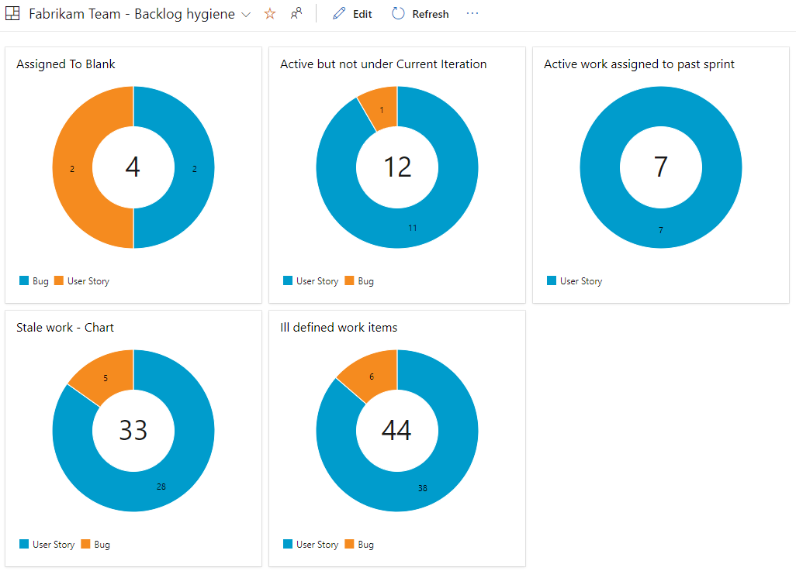

</center>

</div>

---

### Configuration avancée dʼAzure Boards

#### Utiliser les Charts et Widgets de suivi avancé

<div style="font-size:30px">


<center>
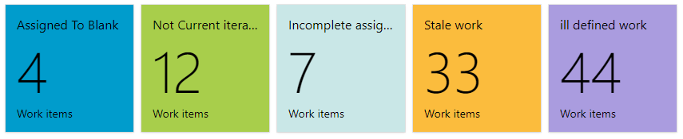
<br>
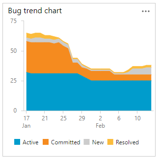
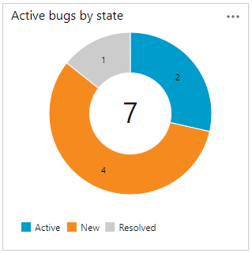

</center>

</div>


